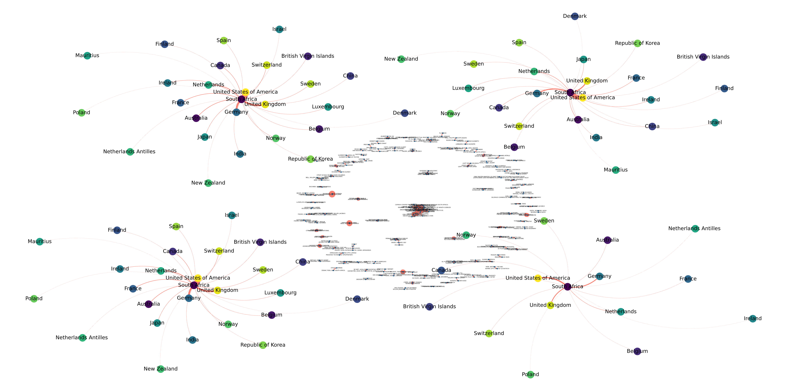
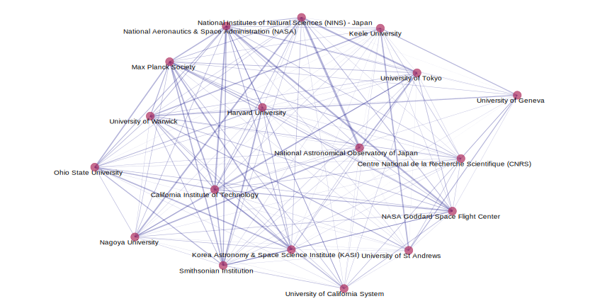
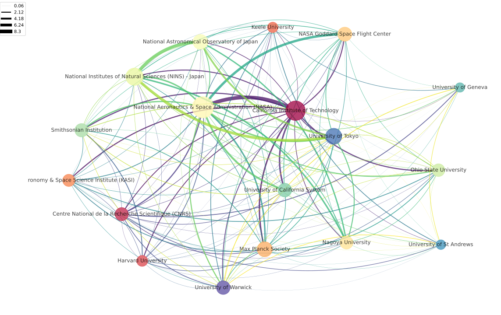

# Introduction
Here we look at how to construct data sets for network analysis using SQL queries and graphs them using R and python.
I always find that the data structuring is the hardest part of any data analysis.
Examples are given from bibliometric data.

## Table of contents
> [Introduction](https://github.com/mpho-mafata/Network-analysis/tree/main#introduction)
>
> [Preparing the data frame](https://github.com/mpho-mafata/Network-analysis/tree/main#preparing-the-data-frame)
> 
>> [Query using postgreSQL](https://github.com/mpho-mafata/Network-analysis/tree/main#query-using-postgresql)
>>
>>> [Create an edgelist](https://github.com/mpho-mafata/Network-analysis/tree/main#Create-an-edgelist)
>>>
>>> [Remove duplicate relationships](https://github.com/mpho-mafata/Network-analysis/tree/main#remove-duplicate-relationships)
>>>
> [Visualize the network](https://github.com/mpho-mafata/Network-analysis/tree/main#visualize-the-network)
>
>> [R plots using GGally](https://github.com/mpho-mafata/Network-analysis/tree/main#r-plots-using-ggally)
>>
>> [Python plots using Networkx](https://github.com/mpho-mafata/Network-analysis/tree/main#python-plots-using-networkx)
>>

# Preparing the dataframe

## Query using postgreSQL
In order to construct a network we need to create a list of nodes (central points of intersection) and edges (lines  connecting each point).

### Create an edgelist
```
CREATE MATERIALIZED VIEW edgelist_orgs AS
SELECT DISTINCT edgelist.ut, edgelist.from, edgelist.to
FROM
(SELECT DISTINCT ARRAYS.ut AS ut, COUNTED.organisation as
      from, unnest (ARRAYS.orgs) AS to
      FROM
          (SELECT DISTINCT ut, ARRAY_AGG (organisation) AS orgs
          FROM mpho.orgs_rankings_top
          GROUP BY ut
          ORDER BY ut
          ) AS ARRAYS

          JOIN

          (SELECT ut, COUNT (ut), organisation
          FROM mpho.orgs_rankings_top
          GROUP BY ut, organisation
          ORDER BY organisation
          ) AS COUNTED
      ON ARRAYS.ut = COUNTED.ut) AS edgelist

WHERE edgelist.from != edgelist.to
ORDER BY edgelist.ut, edgelist.from, edgelist.to
;
```
|   ut | from  | to  |
|  -------------   |  --------------------------------------    |  -------------------------   |
WOS:000084670100019|NASA Goddard Space Flight Center|National Aeronautics & Space Administration (NASA)|
WOS:000084670100019|National Aeronautics & Space Administration (NASA)|NASA Goddard Space Flight Center|
WOS:000172620600024|Harvard University|Smithsonian Institution|
WOS:000172620600024|Smithsonian Institution|Harvard University|
WOS:000172852800015|National Astronomical Observatory of Japan|National Institutes of Natural Sciences (NINS) - Japan|
WOS:000172852800015|National Institutes of Natural Sciences (NINS) - Japan|National Astronomical Observatory of Japan|
${\color{red}WOS:000173507400007}$|${\color{red} Nagoya \space University}$|${\color{red}National \space Astronomical \space Observatory \space of \space Japan}$|
WOS:000173507400007|Nagoya University|National Institutes of Natural Sciences (NINS) - Japan|
${\color{red}WOS:000173507400007}$|${\color{red}National \space Astronomical \space Observatory \space of \space Japan}$|${\color{red}Nagoya \space University}$|
WOS:000173507400007|National Astronomical Observatory of Japan|National Institutes of Natural Sciences (NINS) - Japan|

### Remove duplicate relationships
We will notice that the edgelist will contain similar pairs highlighted above. Note that these are in the same document (same ut number). 
In the case that the data has directionality, these are kept as is in the order they are observed (to and from).
In the case that there are no directional implications, these are duplicate pairs and must be removed.
We start by creating an (alphabetically) ordered list and turn it into an array of pairs.

```
CREATE MATERIALIZED VIEW alphabetical_edgelist_orgs AS
SELECT DISTINCT TABLES.links, TABLES.ut
FROM
(
SELECT ut,
    CASE WHEN
    UPPER(edgelist_orgs."from")>UPPER(edgelist_orgs."to")
    THEN edgelist_orgs."to"||'->'||edgelist_orgs."from"
    ELSE
    edgelist_orgs."from"||'->'||edgelist_orgs."to"
    END AS links
FROM mpho.edgelist_orgs
    ) as TABLES
ORDER BY tables.links, tables.ut
;
```
|ut|links|
|  -------------   |  --------------------------------------    |
WOS:000084670100019|NASA Goddard Space Flight Center->National Aeronautics & Space Administration (NASA)|
WOS:000172620600024|Harvard University->Smithsonian Institution|
WOS:000172852800015|National Astronomical Observatory of Japan->National Institutes of Natural Sciences (NINS) - Japan|
WOS:000173507400007|National Astronomical Observatory of Japan->National Institutes of Natural Sciences (NINS) - Japan|
WOS:000173507400007|Nagoya University->National Astronomical Observatory of Japan|
WOS:000173507400007|Nagoya University->National Institutes of Natural Sciences (NINS) - Japan|
WOS:000178033200022|Nagoya University->National Astronomical Observatory of Japan|
WOS:000178033200022|Nagoya University->National Institutes of Natural Sciences (NINS) - Japan|
WOS:000178033200022|National Astronomical Observatory of Japan->National Institutes of Natural Sciences (NINS) - Japan|
WOS:000178193200015|Centre National de la Recherche Scientifique (CNRS)->Max Planck Society|
WOS:000179648100005|National Astronomical Observatory of Japan->University of Tokyo|
WOS:000179648100005|Nagoya University->National Astronomical Observatory of Japan|
WOS:000179648100005|Nagoya University->National Institutes of Natural Sciences (NINS) - Japan|
WOS:000179648100005|Nagoya University->University of Tokyo|
WOS:000179648100005|National Astronomical Observatory of Japan->National Institutes of Natural Sciences (NINS) - Japan|

### Create final edgelist of organizations for network analysis
Now that we have the pairs, we can group by them in order to remove any duplicate relationship per pair.
Now with uniques pairs per documnet, we can count the number of documents each pair shares (this will become the edge weight).
```
CREATE MATERIALIZED VIEW edgelist_orgs_network AS
SELECT nodes[1] as "from", nodes[2]  as "to", ar.weight
FROM (
    SELECT
        m.weight,
        STRING_TO_ARRAY(m.links, '->') nodes
    FROM (
        SELECT
            COUNT(DISTINCT a.ut) weight,
            a.links
        FROM alphabetical_edgelist_orgs AS a
        GROUP BY a.links
        ORDER BY COUNT(DISTINCT a.UT) DESC
    ) m
) ar
;
```
|from|to|weight|
| --|  -------------   |  --------------------------------------    |
National Astronomical Observatory of Japan|National Institutes of Natural Sciences (NINS) - Japan|135|
NASA Goddard Space Flight Center|National Aeronautics & Space Administration (NASA)|107|
National Institutes of Natural Sciences (NINS) - Japan|University of Tokyo|104|
California Institute of Technology|National Aeronautics & Space Administration (NASA)|98|
Nagoya University|National Institutes of Natural Sciences (NINS) - Japan|93|
Harvard University|Smithsonian Institution|91|
California Institute of Technology|Max Planck Society|84|
Korea Astronomy & Space Science Institute (KASI)|Max Planck Society|83|
Keele University|University of St Andrews|82|
Nagoya University|National Astronomical Observatory of Japan|81|
Korea Astronomy & Space Science Institute (KASI)|Ohio State University|78|
National Astronomical Observatory of Japan|University of Tokyo|77|
Max Planck Society|Ohio State University|76|
Max Planck Society|Smithsonian Institution|76|
Max Planck Society|National Aeronautics & Space Administration (NASA)|74|

# Data wrangling using Python 


## Visualize the network

### R plots using GGally
```
library(RPostgres) # To interact with postgresql
library(readxl)
library(GGally) # ggnet2 is available through the GGally package

# Script settings for postgresql
my_credentials <- readxl::read_xlsx("C:/Users/folder/my_credentials.xlsx")
port = 1234
my_dbname = my_credentials$dbname[c(1)]
my_host = my_credentials$host[c(1)] 
my_user = my_credentials$user[c(1)] 
my_password = my_credentials$password[c(1)]

#first establish connection to database
drv <- RPostgres::Postgres()
print("Connecting to Database…")
connec <- dbConnect(drv, 
                    dbname = my_dbname,
                    host = my_host, 
                    port = my_port,
                    user = my_user, 
                    password = my_password)
print("Database Connected!")

# Fetch required data
table1 = 'edgelist_orgs_network'
schema1 = 'my_schema'
query1 <- dbSendQuery(connec, glue('select * from "{schema1}"."{table1}";'))
network_table <- dbFetch(query1)

table2 = 'orgs_rankings'
schema2 = 'my_other_schema'
query2 <- dbSendQuery(connec, glue('select * from "{schema2}"."{table2}";'))
nodes_table <- dbFetch(query2)
nodes_table$node_size <- as.numeric(nodes_table$pubs)

network_table$edge_size <- as.numeric((network_table$weight)/100)

network_graph <- ggnet2(network_table,
  mode = "fruchtermanreingold",
  layout.par = list(max.delta = 1),
  layout.exp = 0.3,
  label = TRUE,
  label.trim=100,
  label.color = "black",
  label.alpha = 1,
  label.size = 3.5,
  node.shape = 19,
  node.alpha = 0.7,
  node.color = "maroon",
  node.size = 5.0,
  edge.lty= 19, #'solid'
  edge.color = "navy",
  edge.alpha = 0.3,
  edge.size = "edge_size",
  vjust = 1.5,
  hjust= 0.6,
  legend.size = 9,
  legend.position = "right"
)
```


  <figcaption>Network graph using GGaly ggnet2.</figcaption>

### Python plots using Networkx 

```
# get my postgresql credentials
import pandas as pd
credentials = pd.read_excel("C:/Users/folder/my_credentials.xlsx")
port = 5432
my_dbname = credentials.my_dbname[0]
my_host = credentials.my_host[0]
my_user = credentials.my_user[0]
my_password = credentials.my_password[0]

# connect to postgresql
import psycopg # to connect to postgresql
connec = psycopg.connect(
    port=5432,
    host=my_host,
    dbname=my_dbname,
    user=my_user,
    password=my_password)

#Retrieve data tables
cursor = connec.cursor()
table1 = 'edgelist_orgs_network'
schema1 = 'my_schema'
cursor.execute(f'SELECT * from {schema1}.{table1}')

# Fetch required data
network_table = cursor.fetchall();

# Closing the connection
connec.close()

# structure the data and plot the network
network_table = pd.DataFrame(network_table)
network_table.columns = ["from","to","weight"]
del network_table['weight']

import matplotlib.pyplot as plt
import networkx as nx

plt.figure(figsize = (12,8))
network_graph = nx.Graph()

network_graph = nx.from_pandas_edgelist(network_table, "from","to")

network_graph = nx.draw(network_graph, with_labels = True, font_size = 8, alpha=1.0, node_size = 20, node_color="maroon",edge_color= 'darkblue',  linewidths=6,arrows=True, connectionstyle="arc3, rad=0.0")

plt.show()
```

  <figcaption>Network graph using NetworkX.</figcaption>
